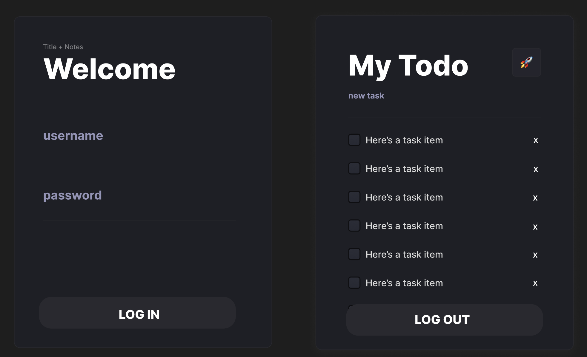

# React Assessment : My Todo / Movie List (CC17)

### Overview

Please follow these conditions before code!

- Programming Language
  - Javascript or TypeScript
- Technologies
  - Javascript DOM, ReactJs, ViteJs, NextJs, Node.js
  - CSS Framework : Bootstrap, Tailwind, Scss, Vanilla css or MUI
- API calling with method POST, GET, PATCH, DELETE for todo listing.
- Create React component
- Create page atleast 2 page
- Use React Hooks

  - useState
  - useEffect

- Bonus point (read more in [Bonus](#Bonus) section)
  - Create React component
    - High Order Components
  - Create Routing 2 page /login, /list
    - createBrowserRouter and RouterProvider
  - Create State management (context or redux)
  - Use Other Hooks
    - useNavigate
    - useParams
  - Create Custom Hooks
  - Deploy Vercel

# Instruction

- Choose 1 of 4 Way of your assessment

  - v1 : todoList with unsecure api
  - v2 : todoList with secure api
  - v3 : movieList with unsecure api
  - v4 : movieList with unsecure api

- understand your figma & Design
- understand your api doc

# APIs Document

#### https://documenter.getpostman.com/view/11730979/2sA3JJA3uG

```js
// You can use this function for getMe
async function getMe() {
  let token; // get token from somewhere
  const res = await fetch('base_url/auth/me', {
    headers: {
      Authorization: `Bearer ${token}`, // put your token here
    },
  });
  const data = await res.json();
  console.log(data);
}
```

# Example UI For Todo List

[Figma TODO LIST CLICK!](<https://www.figma.com/file/7IUnZ0T4gHcMmCUci8QiwW/Todo-List-for-Figma-projects-(Community)-(Copy)?type=design&node-id=1%3A230&mode=design&t=TQaatX2h2Tjg70W3-1>)



# Example UI For Movie List

[Figma Movie LIST CLICK!](<https://www.figma.com/file/EvxT9hj6RQT3bUEGML9eVm/Movie-Listing-Web-App-(Community)-(Copy)?type=design&node-id=401%3A6827&mode=design&t=CgODUDQUdjzYtYWD-1>)


# Instruction

- Section 1 (Part1-Part2) : ทำ App ได้
- Section 2 (Part3 : Bonus) : ทำให้ App ทำงานได้ดี
- Section 4 (Part4 : CleanCode) : ทำให้คนอื่นอยากทำงานด้วย (รวมถึงตัวเองในอนาคต)
- Section 5 (Part5 : Instinct) : Applied Knowledge

## Part-1 : Project Setup and UI (50pts)

### 1A : Project Setup (10pts)

- [ ] Create Project with Create React App or ViteJs
- [ ] Clean up unused files and code
- [ ] Install dependencies or packages that you need for this project
- [ ] Pick some CSS Framework and Install eg. Bootstrap, Tailwind, Scss, Vanilla css or MUI
- [ ] Setup Well-organized Folder Structure
- [ ] Using Git and Github for Version Control System
- [ ] Using Comand Line for run project

### 1B : Build UI with React Component (20pts)

- [ ] Understand UI Design and UI Flow (Figma)
- [ ] Write Clean & Reausable UI
- [ ] Good Naming for Component
- [ ] Manage UI state appropriately

### 1C : Precise UI with Design (20pts)

- [ ] Precise UI : Login Page
- [ ] Precise UI : Todo Page

## Part-2 : Feature and Logic (50pts)

### 2A : Auth and Login (15pts)

- [ ] Login with email and password
- [ ] Can submit form with Enter key or Button
- [ ] Implement State Management for Login Page
- [ ] Connect to API
- [ ] Can Login

### 2B : List Manipulate (35pts)

- [ ] Show List when Render Page (State Management & API)
- [ ] Can Create List item (State Management & API)
- [ ] Can Update List item (State Management & API)
- [ ] Can Delete List item (State Management & API)
- [ ] Can Logout (State Management & API)

#### suggestion

- If you can't call API, you can mock data in your project. you will get half point.
- If yon can't login, you can mock you firstname and lastname. for send to API.

## Part-3 : Bonus (0-100pts)

- [ ] Implement Validation in Login Page (10pts)
- [ ] Implement Validation in Todo Page (10pts)
- [ ] Feature Register and Register Page(20pts)
- [ ] Using Context API for State Management (20pts)
- [ ] Using React Router for Routing (10pts)
- [ ] New Feature or Amazing UI (Depend on your creativity) (15pts)
- [ ] Deploy to Vercel or Netlify (15pts)
- paste your link here

## Part-4 : Become Extraordinary Developer (100pts)

### Clean Code

- [ ] DRY (Don't Repeat Yourself)
- [ ] SOLID (S : Single Responsibility Principle)
- [ ] Avoid Big Component
- [ ] Avoid Magic Value (Hard Code)
- [ ] Readable Code
- [ ] Good Naming for Variable, Function, Component, etc.
- [ ] Good Commenting
- [ ] Implement React Design Pattern and Avoid Anti Pattern
- [ ] Use Async Await instead of Promise then catch
- [ ] Well-organized Folder Structure
- [ ] Well-organized Git Commit Message

## Part-5 : Instinct (50pts)

- [ ] Protect Routed
- [ ] Auto Redirect or Login  
       Hint : using Local storage for token

# Can and Can't

- Open Slide , Docs , StackOverflow , Google
- Don't AI , Don't Copy , Don't Cheat
- Don't use other code from other project (COPY PASTE)
- You can asking for discussion (not solution)
